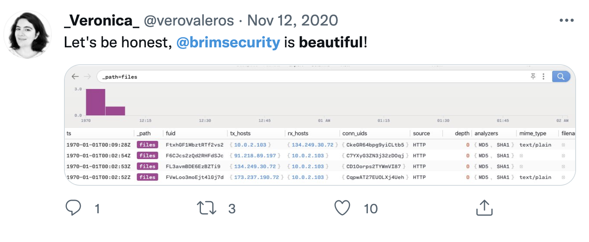
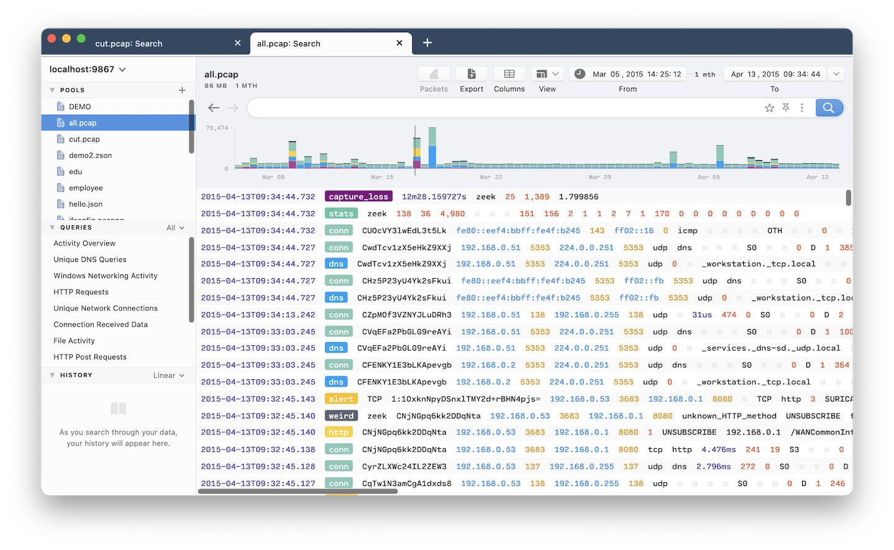
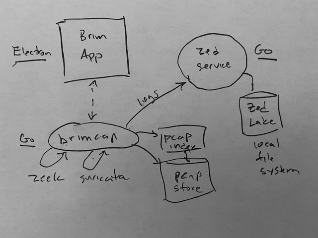
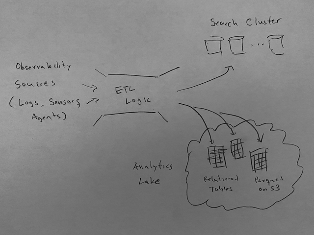
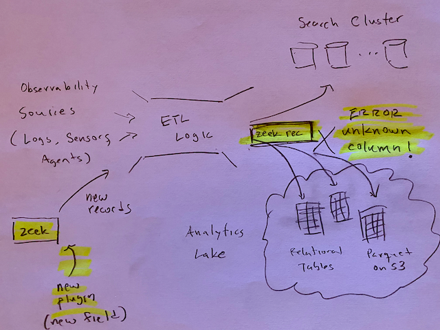
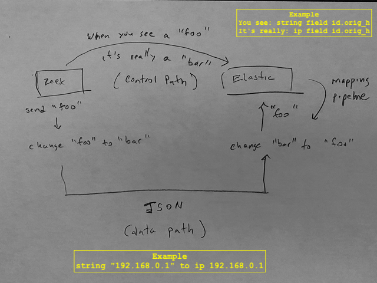
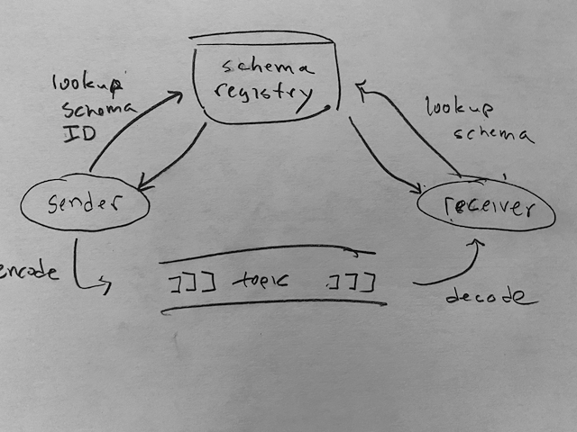
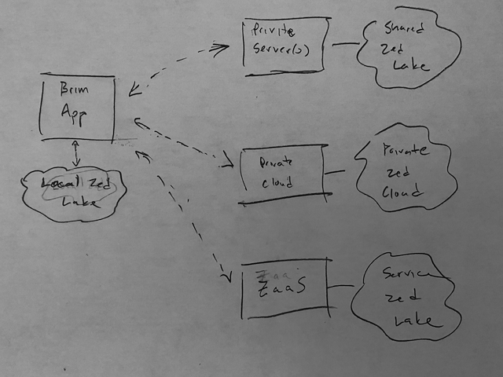
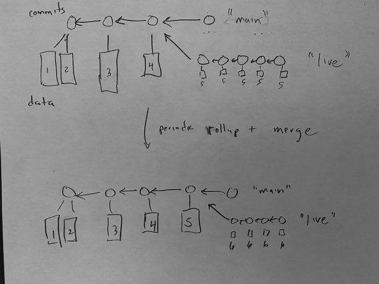

# The [Zed Project](https://github.com/brimdata/zed): Stumbling Upon a [New Data Model](https://github.com/brimdata/zed/blob/main/docs/formats/zson.md) while Hacking on Packets

> This README comprises a presentation given by Steve McCanne at Sharkfest '21,
> 8-9am on September 17, 2021.  You can reproduce all the examples
> herein from the tools referenced and files in this repo.
> This is Part 2 of
> [Steve's talk from 10 years ago](https://sharkfestus.wireshark.org/sf11)
> at Sharkfest '11.

## Abstract

If you've ever tried to assemble operational infrastructure for
search and analytics of network-oriented traffic logs, you know what a
daunting task this can be.  Roughly three years ago, we embarked upon a project
to explore search and analytics for [Zeek](https://zeek.org/)
and [Suricata](https://suricata.io/) "sensors" running on live
network taps or over archived [PCAP files](https://www.tcpdump.org/).
Having experimented extensively
with well-known, open-source search and analytics systems and after talking
to a wide range of practitioners of such tech stacks, we noticed a recurring
and compelling _design pattern_: a search cluster is often deployed to hold recent logs
for interactive queries, while some sort of data lake is deployed
in parallel to hold historical data for batch analytics.

We wondered if this bifurcation between search and analytics was fundamental
or if we could tackle this problem with a different approach.
We eventually concluded these silos arise, at least in part,
from the bifurcation of the underlying data models themselves:
search systems typically use the schema-less model of JSON while
analytics systems use more structured formats like Parquet (or relational tables),
enforcing _one-or-the-other_ design decisions.

In this talk, I'll describe a new data model called Zed --- designed to
unify the document model of JSON with the relational model of databases --
where our ultimate goal is to converge search, analytics, and ETL.
I will then discuss how we've leveraged the Zed data model
in a new query engine that operates over Zed data instead of JSON objects
or relational tables, and admits and a new query language that is a superset
of SQL and log-search style languages.  Finally, I'll outline our
_"work in progress"_ adapting the Zed system to a [Git-like](https://git-scm.com/)
data lake for cloud storage -- called a
[_Zed lake_](https://github.com/brimdata/zed/blob/main/docs/lake/README.md)
--- providing time travel, live ingest, search indexes, and
transactionally consistent views across distributed workers.

## Setup

> Feel free to follow along at [github.com/brimdata/sharkfest-21](https://github.com/brimdata/sharkfest-21)

> Drag [demo.pcap](https://storage.googleapis.com/brim-public-test-data/demo.pcap)
> into the Brim app to start the import...
>
> Thanks to Erik Hjelmvik of Netresec for granting permission to distribute
> this pcap, and thanks also to his employer FM CERT at the time it was created.

> Heads up and joke about video... screen may lag behind voice.

## Introduction

* Some ancient history: PCAP, BPF, tcpdump
* Ten years ago: [Stanford Sharkfest '11](https://sharkfestus.wireshark.org/sf11) and Riverbed
* Present: [Brim](https://github.com/brimdata/brim) and [Zed](https://github.com/brimdata/zed)
    * Zed: stumbling on a new data model through PCAP hacking
    * Like [Crockford and JSON](https://youtu.be/-C-JoyNuQJs?t=20), Zed was _discovered_ not _invented_

## Some Pushback

About 18 months ago, we got some early feedback from smart people...

> Steve... the world doesn't need another data model.

> Steve... the world REALLY doesn't need another query language.  Use SQL.

> Steve... no one cares about your tech.  What problem are you solving?

* I was stubborn and persevered.
* I couldn't really articulate it yet, but I felt we were onto something.
* We're just getting to the point where we can rationalize it all...

## Our Audacious Goal

Despite the pushback, we built useful stuff and have anecdotal validation
from our user community that we're doing something right...

> "Once my data is in Zed, everything is easy..." - Community User

Another community user tweeted:



Underneath all this is a gut instinct:

> Brim+Zed is bigger than just an app and search experience.
> There's something up with the data model we found underneath it all.
> We think Zed is all about _ergonomics_ for easier _data engineering_.

Our audacious goal: _Zed will do for data lakes what JSON did for APIs._

## Zed & Brim

Zed and Brim have become our _research vehicle_ for exploring the data model..

* Zed & Brim are open source (BSD license)
    * [github.com/brimdata/brim](https://github.com/brimdata/brim)
    * [github.com/brimdata/zed](https://github.com/brimdata/zed)
* Search-like experience optimized for Zeek and Suricata
    * [Zeek](https://zeek.org/) - maps packets to contectual logs
    * [Suricata](https://suricata.io/) - threat detections engine
* (quick demo of pcap drag into Brim)



## The Desktop Architecture

While the PCAP is loading, here is the wiring behind the scenes...
* Data organized into "pools" like Mongo _collections_
* `brimcap` bundles integrations for Zeek and Suricata
    * `brimcap` builds a PCAP index
    * `brimcap` loads processed logs into a Zed pool
* Brim interacts with `brimcap` for click-to-packets



> Note: in upper left, size of logs from 4GB pcap and time span

* Brim is
    * A search tool
        * `160.176.58.77` - search of an IP
        * `181.42.0.0/16` - search for IPs in a network
        * `weird` - show me Zeek's weird logs
        * `alert spam` look for who knows what
    * An analytics engine
        * `count() by _path`
        * `count() by query`
        * `_path=="conn" | bytes:=sum(orig_bytes+resp_bytes) by id.resp_p | sort -r bytes`
        * `every 10s count() by _path`
            * (try different intervals, 24h, 1w)
            * This is the query the app uses to create the bar chart.
    * A learning tool - beginner doesn't have to know complex queries
        * Right-click filter by
        * Right-click count by
        * Right-click on pivot to logs
        * Click on column header
    * A security skin
        * Click on conn to show Zeek details
        * Click on Suricata Alerts query
    * A wireshark navigator - Zeek provides context for PCAP drill downs
        * Click to packets

## Our Team

We realized there was a bigger problem to solve and went into research mode...

* Not a typical startup
* A multi-year, research effort
* _Creation of_ open-source project rather than its _commercialization_

We are now transitioning from research mode to execution...

#### Front end
* James Kerr
* Mason Fish
#### Infrastructure
* Steve McCanne
* Noah Treuhaft
* Matt Nibecker
* Al Landrum (ex-Brim)
* Henri Dubois-Ferriere (ex-Brim)
#### Community + "Product" + Jack-of-all-trades
* Phil Rzewski
#### UC Berkeley Collaborators
* Amy Ousterhout
* Silvery Fu
* Sylvia Ratnasamy
* Joe Hellerstein

## Why not JSON + Elastic?

Brim+Zed looks a lot like ELK...

Douglas Crockford: [JSON](https://www.json.org/json-en.html)
* Just send a javascript data structure to a javascript entity
* JSON APIs proliferate: _so much easier_ than XML, SOAP, RPC
* And [node.js](https://nodejs.org) arrived on the backend and we had _full stack_

Shay Banon: [Elastic](https://github.com/elastic)
* Wrap [Lucene Java lib](https://lucene.apache.org/) in a REST API and shard indexes
* Post JSON docs to API
* Submit JSON search queries to API

_It's hard to make things easy._

They did it.  Brilliant, easy, simple.

## The Bifurcation of Search and Analytics

Yet, search alone is usually not enough...

* We saw a recurring design pattern in large-scale deployments
* Need for _historical analytics_
* Bifurcated search/analytics model
    * **Search**: OpenSearch, Elastic, Splunk
        * Unstructured logs or semistructured JSON
    * **Analytics**: in a lake or warehouse
        *  Relational tables, e.g, ClickHouse, BigQuery, Snowflake
        *  Parquet files on S3



## Schemas: A Double-edged Sword

Schemas are incredibly important
* ETL uses them to clean up data
* Warehouses uses relational schemas to organize data across tables
* Elastic uses them to normalize data and recover type richness

But they a double-edge sword:

> Schemas are essential as an organizing _policy_ for your data,
> but they get in the way as a _mechanism_ for data storage and transport.

### Example 1

The ETL pipeline breaks when something changes
* Someone adds a new plugin to Zeek
* The plugin adds a new field to Zeek "conn logs"
* The ETL doesn't have a schema with for that new column



### Example 2

The Zeek log format is type-rich and structured:
```
#fields	ts              uid                     id.orig_h       id.orig_p ...
#types  time            string                  addr            port      ...
1521911721.255387	C8Tful1TvM3Zf5x8fl	10.164.94.120	39681 ...
1521911721.411148	CXWfTK3LRdiuQxBbM6	10.47.25.80	50817 ...
```

Elastic Common Schema (ECS) is a type-rich schema system:
* data communicated as regular type-impoverished JSON
* ingest pipelines map JSON to ECS objects

So we have this song and dance:


### Example 3

Writing data to a Parquet file on S3:
* Scan all records in input to determine schema
* Open the Parquet file with the schema
* Write records that conform to schema

### Example 4

Sending structured data over Kafka with Avro:
* Sender has record to send
* Sender contacts the "schema registry" with record's schema and receives ID
    * (or it retrieves the ID from a local cache)
* Sender tags data of record with ID
* Sender transmits data on Kafka topic
* Receives pulls data from Kafka topic
* Receiver contacts schema registry with record's ID to get schema
    * (or it retrieves the schema from a local cache)
* Receiver decodes record data using schema



### Example 5

Your business is a complex application with complex data pipelines:
* the data models are all defined as _protobuf_ schemas called _protos_
* the system components all communicate using protobuf-compiled gRPC endpoints
* every time a model is updated, everything needs to be recompiled and redeployed

## Policy & Mechanism

In all of the above examples:
* A schema defines the organizing _policy_ for the data, and
* the very same schema constrains the _mechanism_ for encoding the data.

An old design principle says you should separate _policy_ from _mechanism_ ...

Could this be good advice here?

## Zed: A Better Way

What if _the mechanism_ were _self-describing data_:

* A comprehensive _type system_ embedded in the data itself
* First-class types for "types as values"
* Entities in the Zed system adapt to data types
    * instead of being constrained by a rigid set of schemas

And what if _policy_ was enabled by the flexible Zed _type system_
instead of relying on rigid schemas?

Before we can explain how this will work, let's give a quick tour
of the Zed data model.

## Composable Tools

We'll use our tooling for a quick tour of Zed.

We have taken a very modular, "composable tools" approach
* CLI tools written in [Go](https://golang.org/)
* any new functionality developed as CLI command
    * fabulous for dev, test, and debug
    * bite-sized chunks for learning the system
    * most functionality exposed through service API

Like the `docker` command, everything packaged under the `zed` command.

Here are a just few:

* `zed query` - perform Zed queries and analytics on files and Unix streams
* `zed api`- execute commands on a remote Zed lake service (or localhost)
* `zed lake serve` - run a service endpoint for a "Zed lake"
* We have a couple shortcuts:
    * `zq` for `zed query` (play on [`jq`](https://stedolan.github.io/jq/) if you know that tool)
    * `zapi` for `zed api`

## A Zed Tour

We'll use `zq` to take an input, do no processing, and display it
in pretty-printed Zed.

```
echo "..." | zq -Z -
```
We leveraged the familiarity and simplicity of JSON:
* Zed is a superset of JSON
* The human-readable form of Zed is called _ZSON_
* We can take JSON/ZSON as input and pretty-print it:
```
echo '{"s":"hello","val":1,"a":[1,2],"b":true}' | zq -Z -
```
Note the we drop the quotes from field names and use them only when necessary:
```
echo '{"funny@name":1}' | zq -Z -
```
And we're fully compatible with all of JSON's corner cases:
```
echo '{"":{}}' | zq -Z -
```

`zq` supports a bunch of formats so you can output to JSON and other formats:
```
echo '{"s":"hello","val":1,"a":[1,2],"b":true}' | zq -f json -
echo '{"s":"hello","val":1,"a":[1,2],"b":true}' | zq -f csv -
echo '{"s":"hello","val":1,"a":[1,2],"b":true}' | zq -f zeek -
```

## Zed is Comprehensive

Unlike JSON, Zed has a _comprehensive_ type system.

Here is a ZSON record with a bunch of different types:
```
zq -Z values.zson

{
        v1: 1,
        v2: 1.5,
        v3: 1 (uint8),
        v5: 2018-03-24T17:30:20.600852Z,
        v6: 2m30s,
        v7: 192.168.1.1,
        v8: 192.168.1.0/24,
        v9: [1,2,3],
        v10: [1(int32),2(int32),3(int32)],
        v11: |["PUT","GET","POST"]| (=HTTP_Methods),
        v12: |{{"key1","value1"},{"key2","value2"}}|,
        v13: { a:1, r:{s1:"hello", s2:"world"}}
}
```
What we _don't do here_ is define a schema then fit the values into
the schema.
* Data is always self describing.
* No need to declare types explicitly.
* No external schema registry needed.

As in Brim, the Zed query language lets you operate on Zed data:
```
zq -Z "cut v1,v2,v7,sum:=v1+v2,net:=network_of(v7)" values.zson
```

Most data structures from any modern language can be marshaled into ZSON
without loss of information.

> Zed has more types and "type unions", but I'll leave these details out of
> this talk.  This is all documented in the [ZSON spec](https://github.com/brimdata/zed/blob/main/docs/formats/zson.md).

## First-class Types

* A Zed value always has a type
* Zed _types_ are Zed _values_
* The `typeof` operator creates a _type value_ from a value
```
echo '{s:"hello"}' | zq -Z "typeof_s:=typeof(s)" -
```
The type of a type value is type `type`:
```
echo '{s:"hello"}' | zq -Z "typeof_s:=typeof(s) | typeof_type:=typeof(typeof_s)" -
```

The special value "this" refers to the current record in a declarative style:
```
echo '{s:"hello"}' | zq -Z "put copy:=this" -
```
`this` is a value, so it always has type:
```
echo '{s:"hello"}' | zq -Z "put typeof_this:=typeof(this)" -
```
Well that's starting to look like a schema...

Compare with JSON/Javascript:
```
node
typeof({s:"hello"})
```
Hmm, another limitation of Javascript.  This is not helpful here.

Let's try something a little more complex:
```
echo '{name:"Sally",city:"Berkeley",salary:350000.}' | zq -Z "cut typeof_this:=typeof(this)" -
```
And now, let's name the schema with a Zed typedef:
```
echo '{name:"Sally",city:"Berkeley",salary:350000.}(=employee)' | zq -Z "cut typeof_this:=typeof(this)" -
```
Isn't this exactly a relational schema?

> This is powerful: we can now get the schema from the data itself
> and do not have to synchronize data values with some external schema definition.

## Converging the Document and Relational Models

So this feels like a promising direction to converge the document and relational models.

Many relational tables start out as CSV.

Let's make some sample data:
* Take some CSVs, clean them, and form ZSON
* Tack on some junk that doesn't fit in `junk.json`
* Import the "pile of stuff" into Brim and play around with it

```
cat employees.csv
cat deals.csv
cat junk.zson

zq -z -i csv "type deal = {name:string,customer:string,forecast:float64}; this:=cast(this,deal)" deals.csv > pile.zson
zq -z -i csv "type employee = {name:string,city:string,phone:string,salary:float64}; phone:=int64(phone) | this:=cast(this,employee)" employees.csv >> pile.zson
zq -z junk.zson >> pile.zson
```

Ok, let's get this file to Brim.

Instead of dragging it in, we'll go though the API with `zapi`.
> Remember there is `zed lake serve` process running to support Brim.

```
zapi create PileOfStuff
zapi use PileOfStuff@main
zapi load pile.zson
```
> The "zapi use" command is like "git checkout".

Brim doesn't really know what to make of it.
* It doesn't look like Zeek or Suricata
* It doesn't have timestamps
* There's no single schema to organize it in a table.

But we can query it in Brim...

> Since I was told no one wants and new query language and I should use SQL,
> we made Zed a superset of SQL...

```
SELECT * FROM employee
SELECT * FROM employee | cut typeof(this)
SELECT name,salary FROM employee WHERE salary >= 250000 ORDER by salary DESC
SELECT * FROM deal
SELECT name, sum(forecast) as forecast FROM deal GROUP BY name ORDER BY forecast DESC
SELECT name, union(forecast) as deals, sum(forecast) as total FROM deal GROUP BY name ORDER BY total DESC
SELECT d.customer as customer, d.name AS name, e.phone as phone FROM deal d JOIN employee e ON d.name=e.name
```
Note all the queries worked just fine with the junk in the way!

This is because the _Zed type_ defines the table at query time (_policy_),
and the data is not stored in a fixed-schema relational table (_mechanism_).

The schema
* is _neither required_ to define the data,
* nor _does it stop you_ from putting the data into the system.

James, from our team, summarized it nicely:
> So to summarize my understanding, a database has a mechanism to write data to disk. It also has a policy that data in a table must conform to a schema. Therefore to use the “write data to disk” mechanism, that data must conform to the policy of the table’s schema.
> With Zed, data need not conform to any policy before it gets saved to disk. Then later a policy can deem certain types of data valid based on its shape.

## Schema Discovery

With Zed, we can let the data in before we know it's shape.

> Because data is "allowed in" without knowing its schema ahead of time,
> you can use the very same system to explore and discover the "shapes" of
> data (i.e., their schemas) before you've figured out how to clean it up.

Zed's type system is the key to introspection and "schema discovery".

Key insight from Henri:
> Because Zed types are also values, we can put a type anywhere a value
> goes... in particular, a type can be a group-by key.

```
count() by typeof(this)
```
And now we can clearly see the junky shapes mixed in with our tables.

> I love this query so much, I have it in my query library as `Shapes`.

And we can filter the junky values with this:
```
is(type({a:string,b:string,c:string})) or is(type({message:string}))
```
So the clean data is
```
is(type(deal)) or is(type(employee))
```
Let's put the clean data in a new pool...
```
zapi create CleanTables
zapi query "from PileOfStuff@main | is(type(deal)) or is(type(employee))" | zapi load -use CleanTables@main -
```
Now if I look at the shapes in the clean table, I can confirm it worked:
```
count() by typeof(this)
```

## Introspection of the PCAP Data

So let's go back to the PCAP example in the app and run Henri's query:
```
count() by typeof(this)
```

Ok, that's really powerful, but it would be more intuitive to see a sample
value of each type...  you can use the _any_ aggregator!
```
any(this) by typeof(this) | cut any
```
We love this so much we call it _sample_:
```
sample
```
You can sample a field too...
```
sample uid
sample query
sample id.orig_h
```
But if we go back the top level, we could see what the data would look like
if we tried to fuse the shapes all into one uber schema using the `fuse` operator...
```
sample | fuse
```
And here is an important insight:
> This ultra wide table with many columns is precisely how data warehouses work
> (or Parquet files that hold lots of columns).  You define a single, very-wide schema
> to hold any possible field that might show up, and as long as your ETL logic
> can find a slot in this _single_ schema for all the fields of an incoming record,
> everything is fine.  But when a field shows up that doesn't fit, you have
> problems.  Data warehouses compress all the null columns efficiently,
> and perform column-oriented analytics really well.

* No wonder there is such a big gap between the relational model and the
document model.
* The two forms of data look nothing alike!

## But ZSON is Slow

Ok, this separate of policy and mechanism argument sounds great, but how can
you make this ZSON text format efficient?

Like JSON, text-based ZSON is horribly inefficient.

And columnar data warehouses are really fast!
* the wide-schema model has evolved over decades
* modern data warehouses use all sorts of clever trick to make things fast

Of course ZSON can't compete.

But maybe the Zed data model can!

## Making Zed Fast

Let's just borrow the good ideas from Avro and Parquet...
* [Avro](https://avro.apache.org/) from the Hadoop ecosystem
* [Parquet](https://parquet.apache.org/) from Google's [Dremel paper](https://research.google/pubs/pub36632/)

But leave out the schema-rigid bits...
* Avro requires a schema for every record or completely uniform records
    * or a schema registry as mentioned earlier
* Parquet requires a schema for each file where all records conform to the schema

To this end, we end up with a format of families that all adhere to the Zed data
model but emulate the efficiency of Avro and Parquet.

* ZSON is like JSON
* ZNG is record-based like Avro
* ZST is columnar like Parquet

But they all conform to the same Zed data model.

## The ZNG Type Context

ZNG works by including small typedefs in the binary stream every time
a type is needed by a record.

These mappings are stored in a table called the "type context".

The type context is
* locally scoped so no need for a schema registry
* mergeable so different streams with different type contexts can be interleaved, and
* concatenatable so streams can easily be processed.

For example,
```
echo '{a:1}' | zq -f zng - > example1.zng
echo '{s:"hello"}' | zq -f zng - > example2.zng
hexdump -C example1.zng example2.zng
cat example1.zng example2.zng example2.zng example1.zng example2.zng | zq -
```
> Note `ff` end-of-stream marker.

## ZST is Self-organizing

Armed with the type context, we can create ZST files where the columnar
layout is
* not defined by a single, wide schema created before writing to the file,
* but rather self-organizes around the types in the type context on the fly.

For example,
```
cat pile.zson
zq -f zst pile.zson > pile.zst
hexdump -C pile.zst
```
You can see the column in the hexdump output.

More importantly, the data model is exactly the same across format families,
so we can boomerang through the formats without loss of information...
```
zq -f zng -i zst pile.zst > pile.zng
zq -z pile.zng > pile-boomerang.zson
diff pile.zson pile-boomerang.zson
```

Of course, you can't do a boomerang with Parquet...
```
zq -f parquet pile.zson > pile.parquet
```
Oops, it needs a single uber-schema, but we can get that with `fuse`
```
zq -f parquet "fuse" pile.zson > pile.parquet
```
But now when we read it, it's not the same!
```
zq -Z -i parquet pile.parquet
```

## The Zed Format Family

There you have it... the Zed format family

* [ZSON](https://github.com/brimdata/zed/blob/main/docs/formats/zson.md) (like JSON) - human readable like JSON
* [ZNG](https://github.com/brimdata/zed/blob/main/docs/formats/zng.md) (like Avro) - performant, binary, compressed record-based format
* [ZST](https://github.com/brimdata/zed/blob/main/docs/formats/zst.md) (like Parquet) - performant, binary, compressed column-based format

They are all perfectly compatible because they all adhere to the same
data model: no loss of information transcoding between formats.

ZNG typically 5-10X smaller than ZSON/JSON...
```
zapi query "from demo.pcap" > demo.zng
zq -f ndjson demo.zng > demo.ndjson
ls -lh demo.*
```

## The Zed Lake

Okay, final chapter of the talk: How do we leverage the Zed data model at
scale?

Enter the Zed Lake.



### Native cloud design

Built on a cloud storage model...
* Objects are stored as ZNG/ZST, immutable, and have globally unique name
* Search indexes are just ZNG objects (with simple b-tree indexing)
* All state changes to the lake view stored in a cloud-based transaction journal

### The Git Design Pattern

We realized many compelling use cases could be supported by a Git-like
model for the Zed lake.
* Create branches
* Work on a branch, test, debug
* Merge branch to main or drop

The Zed Lake's use cases are malleable through its API
* the Zed service is not a monolithic black box
* rich API with many verbs for automation and tooling
* let's look at a few use cases

### Automatic Insights with Programmable Analytics

It's one thing to get data into a Zed lake, it's another to derive insights
and automate that process...

A security example...
* Compute an edge graph of all communicating host pairs
* Add some connection stats
* Look for bad SSL certs
```
cat graph.zed

filter _path=="conn" OR _path=="ssl"
| summarize
    count(_path=="conn"),
    maxConnTime:=max(duration),
    maxConnBytes:=max(orig_bytes+resp_bytes),
    totConnBytes:=sum(orig_bytes+resp_bytes),
    totConnTime:=sum(duration),
    badSSL:=or(!(validation_status=="ok" OR validation_status==" " OR
                validation_status=="" OR validation_status==null))
   by id.resp_h,id.orig_h
```

Because everything is driven off the API, it is easy to run
this automation at periodic intervals and populated a data pool with
the analysis.

You could do this on a time window, but I'll do the whole pool by hand:
```
zapi create NetGraph
zapi query -use demo.pcap@main -I graph.zed | zapi load -use NetGraph@main -
```
> (show bad certs in app, click through to logs, then to packets)

### Automatic Data Decoration with Join

What about augmenting data in addition to deriving insights?

Enter `join`

Say you had a list of badguys.
```
zq badguys.zson
```
And you wanted to decorate your logs that had an IP in this list.

First we put the badguys list in it's own pool...
```
zapi create BadGuys
zapi use BagGuys@main
zapi load badguys.zson
```
> (see BadGuys pool in app... it's like a toy threat intel feed.)

Now we can do a join with the logs, but let's test it first on a branch.
```
cat join-badguys.zed

zapi branch test
zapi use test
zapi query -I join-badguys.zed | zapi load -
```
Use `log` to see that we added the joined data on the branch,
and run a test query.
```
zapi log
zapi query "count() by _path"
```
and narrow it down to the new records with a simple search...
```
zapi query "count() by _path | badguy"
```

> Check app and see that it's not there because it's not in main.

Okay, it's looks good so merge branch `test` into `main`!
```
zapi merge main
```
> New check app and see the records...

### Live Ingest

A main/live branching model for streaming pipelines... work in progress.



* Small, batch updates to tip of `live` branch
    * Many times per second
* Orchestration agent sweeps the `live` branch into `main`
    * Compact little data objects into big objects
    * Compute search indexes for new data
    * Merge `live` into `main` and rebase `live` back to tip of merged `main`

## Summary

* Showed you our new app Brim
* Described the Zed data model underneath Brim that we stumbled upon while hacking PCAPs
* Proposed that Zed can
    * unify the document and relational models
    * elegantly separate the schema-policy from the data-mechanism
    * be performant with its record- and columnar-based formats
* Walked through how it all comes together in a Git-like Zed lake

We have a ways to go, but we hope someday that...

---

**_Zed will do for data lakes what JSON did for APIs._**

---

Do you buy it?  [Dimitri Does!](https://www.youtube.com/watch?v=hOQfp41nqp8)

### Join in on the fun!

If you're interested, please connect with us online

* [Brim public slack](https://www.brimsecurity.com/join-slack/)
* [Brim twitter](https://twitter.com/brimsecurity)
* [github.com/brimdata/brim](https://github.com/brimdata/brim)
* [github.com/brimdata/zed](https://github.com/brimdata/zed)

## Bio

Steve McCanne is the "Coding CEO" at Brim, a small startup
working on the open-source Zed Project and a new application called "Brim"
that leverages Zed.  Back in the days before the Web, Steve worked at
the Lawrence Berkeley National Laboratory where he developed BPF,
libpcap, the PCAP file format, and the tcpdump language and compiler,
while also working on the Real-time Transport Protocol (RTP) for
Internet video when the telcos claimed that real-time Internet
communication was impossible without end-to-end virtual-circuit guarantees.
(Guess who was right?)  After a brief stint in academia in the late '90s,
Steve crossed over to the dark side, became a tech entrepreneur,
and never looked back.  He has founded several startups and
took his '02 company and Sharkfest's sponsor, Riverbed, public in '06.
After many years working in other areas of tech, Steve has
returned to his roots, dabbling again with PCAPs, leading him to Zed
and a whole new way to approach network and IT observability data.
